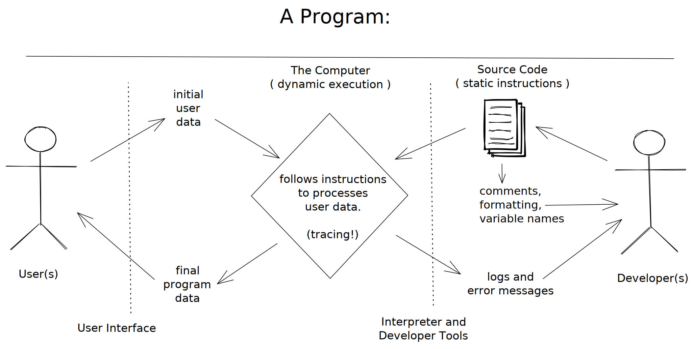
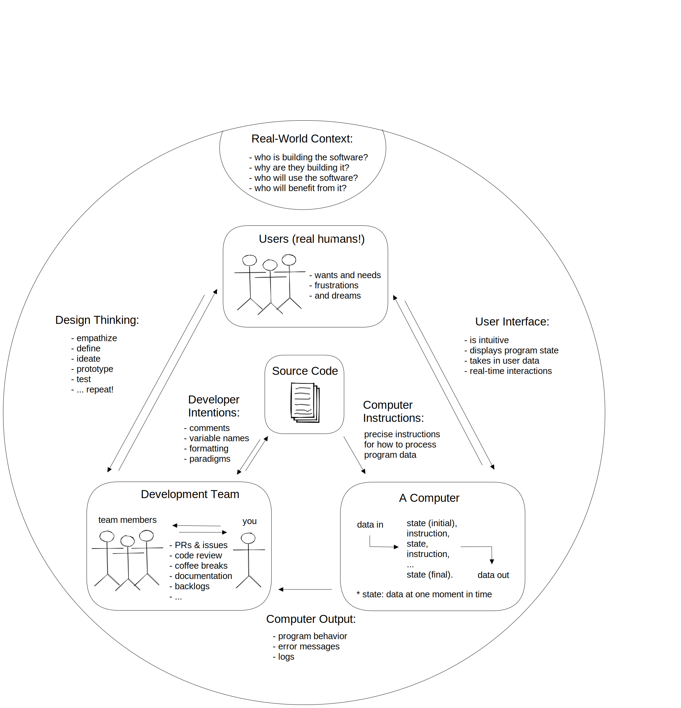

{/* pull from ex-koli calling drafts */}

import { Tab, Tabs } from "nextra-theme-docs";

Big-Picture Diagrams are a simple enough idea but very useful for setting learner expectations, motivating course objectives, structuring discussions, and curriculum planning. Before looking at some ways to use Big-Picture Diagrams let's see what they _aren't_. They aren't concept maps, learning objective graphs, ontologies, or any other formal representation of course objectives.

Big-Picture Diagrams are informal diagrams representing what a learner is expected to _do_ with what they learn. Diagrams can show the communication dynamics of a team project, the roles of different technical components in a system, or highlight the ethical and social considerations in a project.

Each curriculum calls for it's own diagram tailored to the level of your learners, the course objectives, and any other relevant details. It's even useful to have different diagrams at different points in the curriculum. For example one high-level diagram introduced on day 1 to illustrates the end goal of your course, and smaller diagrams that zoom in on different portions of the main diagram over time.

I even find it helpful to make these diagrams as a first step in curriculum design before scoping technical content, beginning any lesson plans, assessments, projects, or resources. Starting with a clear and conversational idea of what learners should _do_ helps me decide what to exclude from the curriculum and makes the rest of curriculum design more intuitive.

Starting with a clear big-picture has also helped me find un-intuitive design decisions. Starting with a diagram helped me see that the fundamental learning objective for web development is actually collaborative writing - project planning, software development, UI/UX design ... everything else relies on learners' abilities to collaboratively write a document. This led to starting programming courses with a full module on version control, project managment workflows and markdown before learning any code. (See the [Spiderweb Curriculum](./spiderweb-curriuclum) for more on this idea.)

Enough words, here are some diagrams for inspiration.

## Programming is Writing

These high-level diagrams show how collaborative writing and collaborative programming are similar.

You can use them alongside an exercise where learners try to edit one google doc at the same time to movitave version control, or you could use them clarify the relationship between source code and running programs in the context of a group project.

<Tabs
  items={[
    "1. Collaborative Writing",
    "2. Writing for a Computer",
    "2. Writing for Users",
  ]}
>
  <Tab>
    
  </Tab>
  <Tab>
    
  </Tab>
  <Tab></Tab>
</Tabs>

## Collaborative Development

This progression of diagrams build a big picture of web development starts with collaborative writing in a project context and gradually introduces aspects of Web Development, ending with basic web pages that interact with users and process their data.

<Tabs
  items={[
    "1. Writing with Purpose",
    "2. Coded Instructions",
    "3. User Exerience",
    "4. User Data",
  ]}
>
  <Tab>
    
  </Tab>
  <Tab></Tab>
  <Tab></Tab>
  <Tab></Tab>
</Tabs>

## Data Science

The first diagram first introduces a big-picture understanding of data science. The second diagram zooms in on one leg of the triangle (_analyzing data_) and illustrates how members of a data science team might collaborate around a code base to learn from data.

<Tabs items={["1. Data Science?", "2. Analyzing Data"]}>
  <Tab>
    
  </Tab>
  <Tab>
    
  </Tab>
</Tabs>
