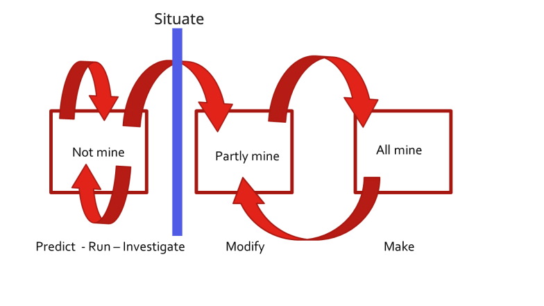

import { Steps } from "nextra-theme-docs";

**PRISMM** is an approach for structuring lessons inspired by [PRIMM](https://static.teachcomputing.org/pedagogy/QR11-PRIMM.pdf?ref=national-centre-for-computing-education&_ga=2.46945317.367157475.1677691480-180243046.1676023361). PRISMM includes an extra _situating_ step after students have studied a program, but before they write their own similar programs. This step is for exploring how software [relates to the wider world](./big-picture-diagrams.mdx). You can visualize the PRISMM process like this:

> diagram adapted from [primmportal.org](https://primmportal.com/)

To start using PRISMM in your class you can begin by sharing out any piece of level-appropriate code as a study reference, with some support learners can get used to guide their own study with the PRISMM steps. Doing this regularly with a series of programs that progress alongside your learners is a (relatively) low-effort way to practice teaching with PRISMM. If you would like more guidance to get started, try using existing resources for PRIMM and adding a little extra time for a _situating_ discussion. [PRIMM Portal](https://primmportal.com/teaching-materials/) has a collection of lesson plans for Python.

The PRISMM steps in more detail:

<Steps>

### Predict

Students discuss a program and predict what it might do, drawing or writing out what they think will be the output. At this level, the focus is on the function of the code.

### Run

Students run the program so that they can test their prediction and discuss in class.

### Investigate

The teacher provides a range of activities to explore the structure of the code; this involves activities such as tracing, explaining, annotating, and debugging. [Study Lenses](../study-lenses) is has many features to support investigating code.

### Situate

Discuss who wrote the program, why they wrote it, who would use the program, and why they would use it. Seeing the intentions behind and effects of software can help learners understand their digital world, and gain a sense of agency.

### Modify

Students edit the program to change its functionality or purpose via a sequence of increasingly challenging exercises; the transfer of ownership moves from the code being ‘not mine’ to ‘partly mine’ as students gain confidence by extending the function of the code

### Make

Students design a new program that uses the same structures as the code they studied, but is designed to solve a differnet problem or is adapted for a different end user.

</Steps>
