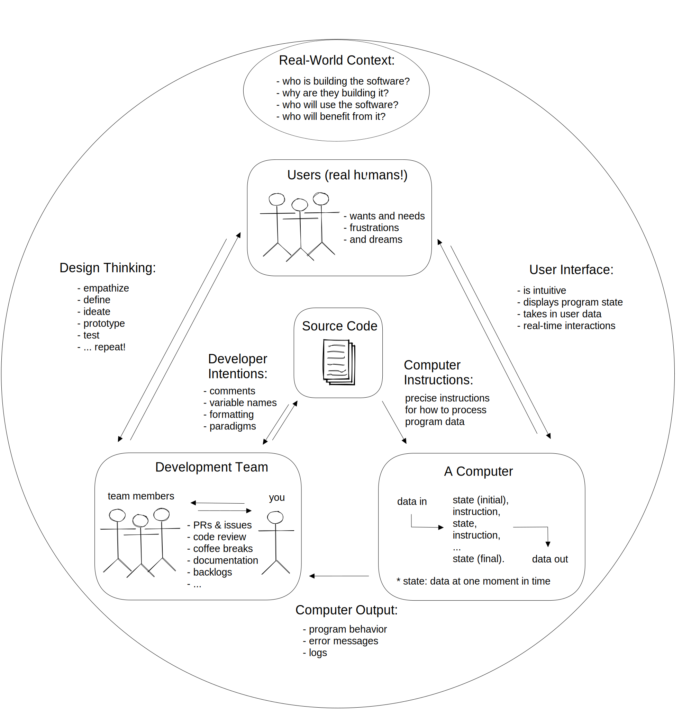
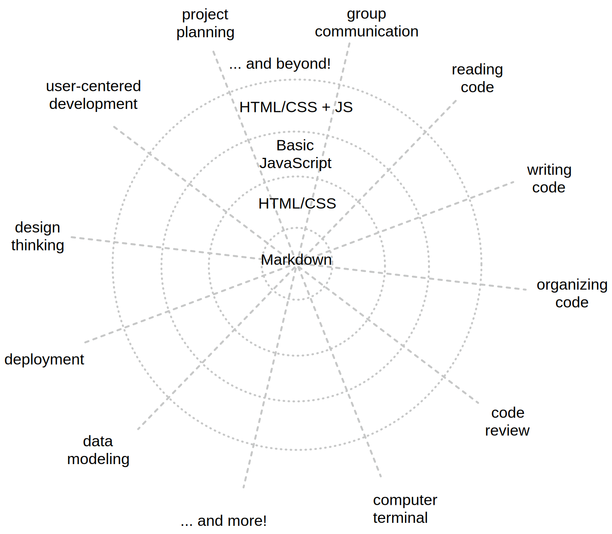

## What is Programming?

Programming is communication. It's also a lot of other things, but this
curriculum will focus on the different ways you communicate with your code.

When you write code you are really just writing a text document, exactly like
you might write an email or a note. The biggest difference between an email and
a computer program is _who you are writing for_.

When you write an email you're writing for the person who will be reading it.
When you write a computer program you are writing for 3 very different audiences
at the same time! One single document (your code) needs to be understandable to:

- **Developers**: A developer needs to read your code and understand what you
  were trying to do and why.
- **Computers**: Your code needs to have _perfect_ syntax so the computer can
  parse it, and you must write instructions that are allowed by the programming
  language or the computer will throw an error.
- **Users**: The instructions you give to the computer must create an intuitive
  and pleasant experience for the user.

Being a developer means understanding how all these characters interact, then
communicating with everyone involved to deliver quality software within your
project's constraints. This diagram shows the different channels of
communication in a software project:

## Layers of Skills

Software Development is a many layered skill. One way to break it down is to think of these layers:

1. **Planning and Collaborating**: _Breaking down large problems into tasks that can be shared_
   - > _This is introduced in the **Workflows** and **Agile Develompent** modules, and practiced in every other module_
1. **Source Code**: _The basic literacy of programming_
   - Learning the key words \(_vocabulary_\) and syntax \(_grammar_\) for your programming language
   - Being able to read your code out loud, tracing it's execution as a computer would
   - Understanding what the developer wanted to say with their code
   - > **Welcome to JS** will focus on these skills\_
1. **Machine Instructions**: _The basic mechanics of programming_
   - Understanding the life-cycle of your program
   - Understand how the computer will interpret your source code to create a running program
   - Understand what about your code matters to the computer, and what matters to people
   - Fixing syntax errors that occur when you try to run your code
   - Predicting which lines of code will be executed in which order
   - Predicting how each line of code will change what is stored in program memory
   - Reading error messages & callstacks to fix fix semantic errors that occur when you run your code
   - > **Inside JS** and **Asynchronous Programming** will focus on these skills\_
1. **Problem Solving & Algorithms**: _Breaking down large problems to be solved in small steps_
   - Understanding a coding challenge and being able to break it down in different ways
   - Determining which solution strategies are correct for which types of problems
   - Understanding how test cases are used to describe your solution strategy
   - Identifying the best language feature to use with your strategy
   - Reading test cases to understand how code is _supposed to_ behave
   - Using Test Cases to structure your solution design process \(Test Driven Development\)
   - Identifying and isolating mistakes in your code by reading failing test cases
   - Demonstrating your code does what you think it does by passing test cases
   - > _**Behavior, Strategy, Implementation** Module will focus on these skills_
1. **Software Design**: _Organizing smaller pieces of code into full software solutions_
   - > _Every module starting with **Separation of Concerns** will focus on these skills_
1. **Context**: _Who uses a program, what is it's impact, and where did it come from?_
   - Real people will use your software, is it accessible to them?
   - Your software exists in a society, what it's impact on others?
   - Someone planned and build your software, what were their motivations?
   - > _**UX/UI Design** and the **Final Project** Module will focus on these skills_

## The Curriculum: a Spider Web

It's helpful to imagine the DeNepo curriculum as a spider web with two types of
thread:

- **Skills**: The lines going out from the center represent the skills you will
  practice each and every week.
- **Technologies**: The circles going out from the center represent the
  languages and technologies you will learn in each module.

The _Workflows_ modules starts in the center of this spider's web. You will
already be practicing all of the skills but with projects that use only
Markdown. Because Markdown is small and simple you will be free to focus on more
important things like communication and code review.

After you have practiced working on full group projects written in markdown, you
will expand to the second circle with the _Agile Development_ module. This is
when you learn how to collaboratively plan and develop web pages written with
HTML and CSS. You will continue practicing all of the skills you learned in
_Workflows_, only now the programming languages will be more complex.

... and so on, forever! DeNepo is just the beginning. Your web will continue to
grow after you finish studying this curriculum, you practice the skills in your
web and add rings of new languages and technologies.

